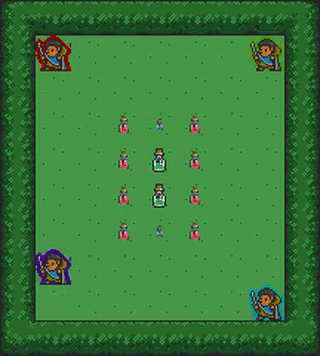
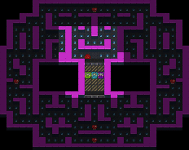
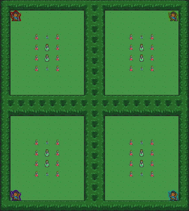

# RLlib Multi Agent Self-Play Example

<div style="text-align: center">
    
    
    
</div>

More documentation can be found [here](https://griddly.readthedocs.io/en/latest/rllib/multi-agent/index.html)

This repository can be used as a starter for training any of the Griddly environemnts using RLLib

This example trains the "Foragers" environment which is described [here](https://griddly.readthedocs.io/en/latest/games/Partially_Observable_Clusters/index.html)

## Installing Dependencies

We use poetry to manage the dependencies of this project. You can set up a poetry environment with the command:

```commandline
poetry install
```

You can then activate the poetry environment using:

```commandline
poetry shell
```

## Training the example environment

```commandline
python train.py
```

### Options for training

There are three variables that you can change in train.py:

```python
environment_name = "TestEnvironment"
environment_yaml = "Single-Player/GVGAI/clusters_partially_observable.yaml"
model_name = "SimpleConvAgent"
```

#### environment_name

The name of the environment

#### environment_yaml

the yaml file containing the GDY of the environment

#### model_name

We provide two simple models that can be used are `SimpleConvAgent` and `GlobalAveragePoolingAgent`


